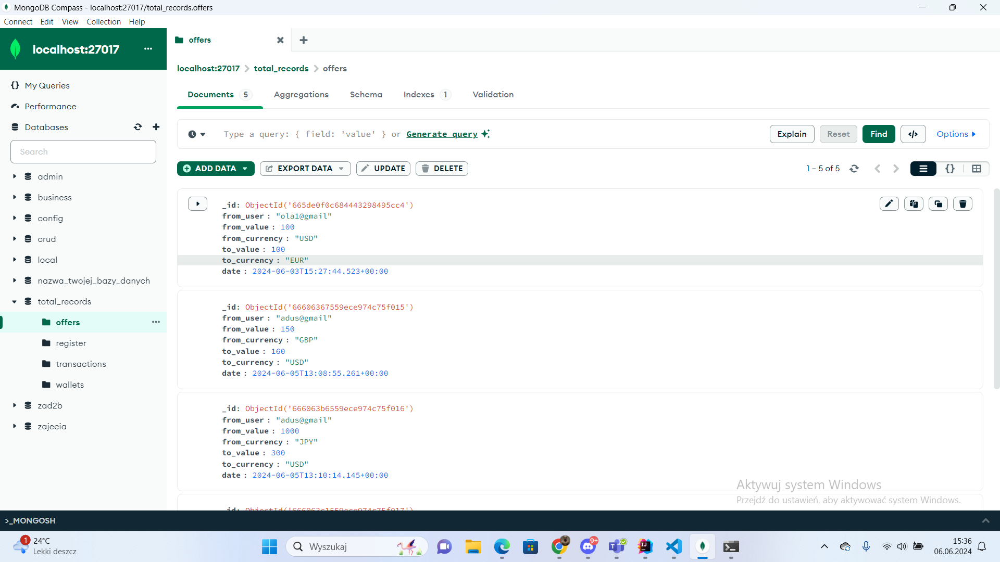
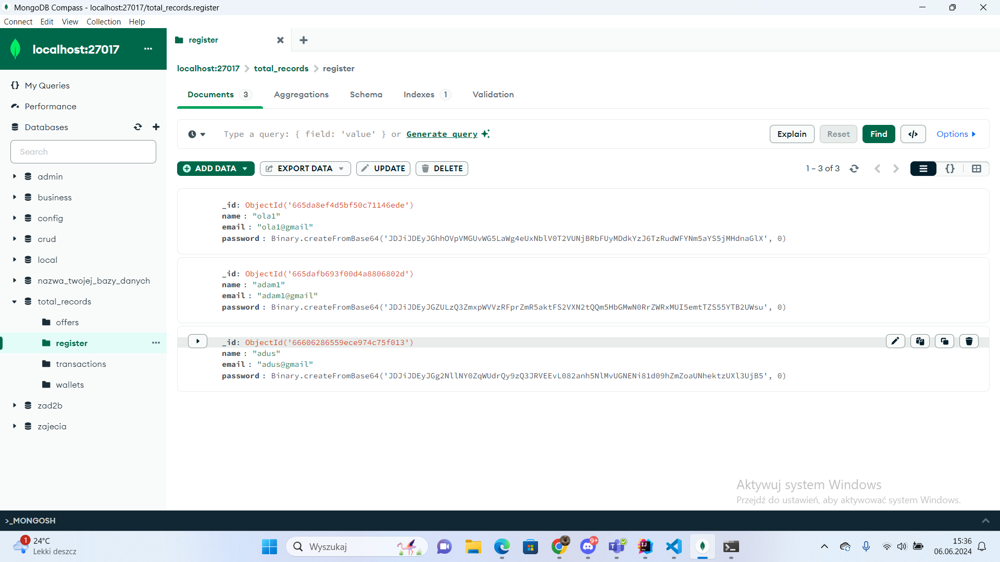
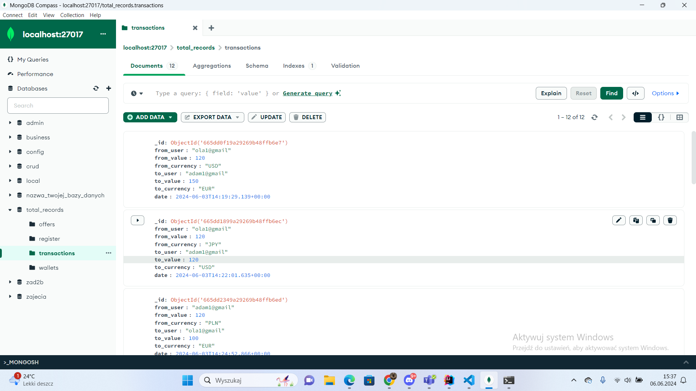
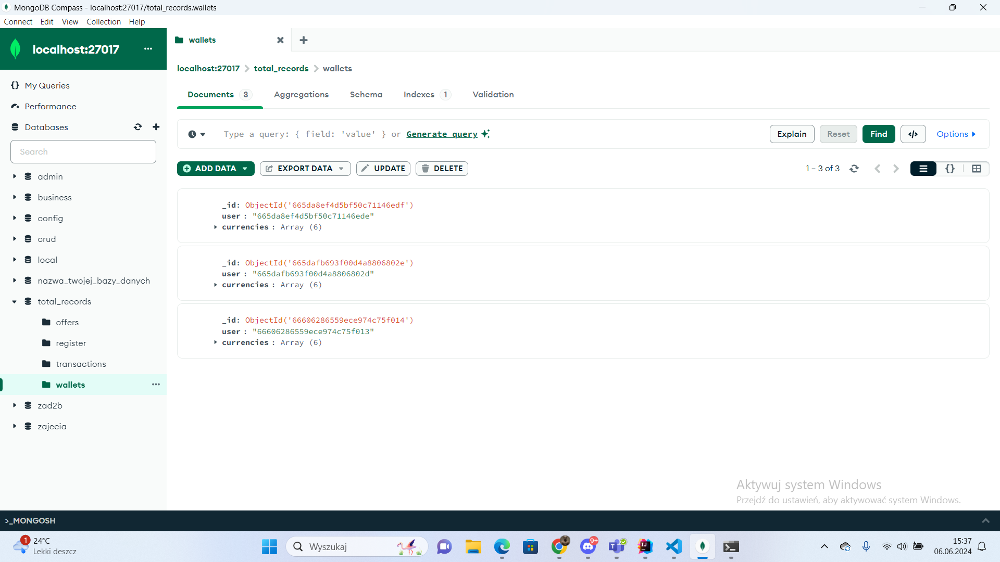
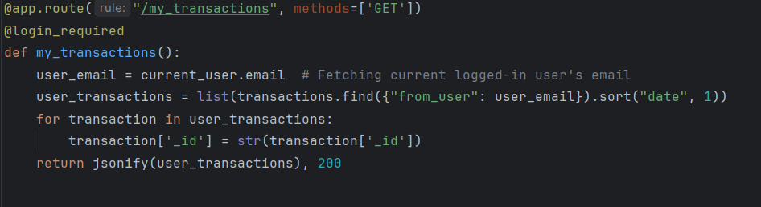
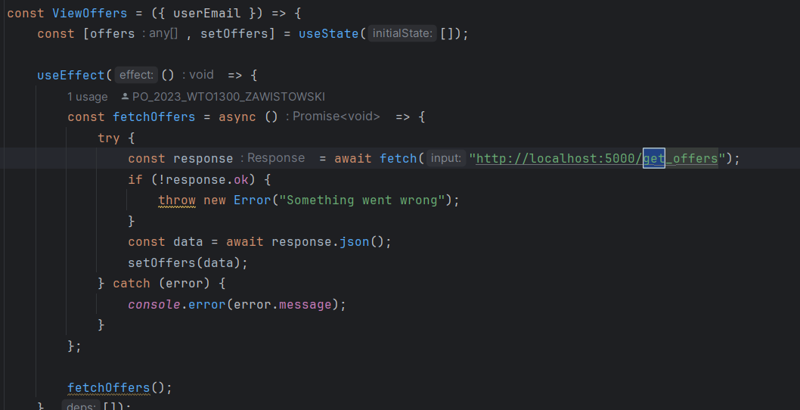
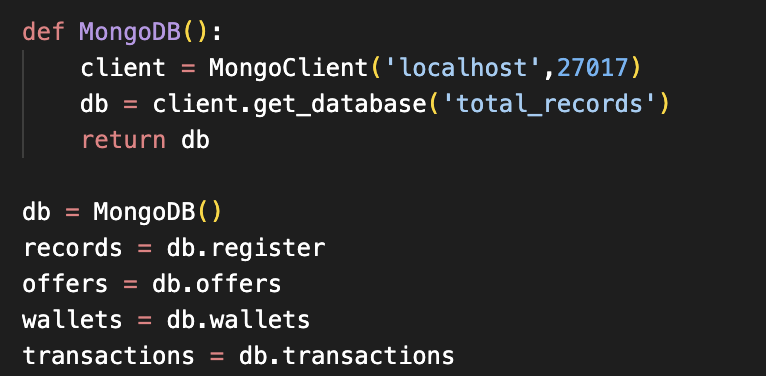

# Dokumentacja Projektu Minigiełdy Walutowej

## Autor:

- Michał Plaza

## Idea:

Działanie aplikacji minigiełdy walutowej ma w prosty sposób symulować działanie giełdy papierów wartościowych, której użytkownikami są osoby posiadające we własnym portfelu aktywa i dokonujące transakcji pomiędzy sobą. Nasza aplikacja umożliwia dokonywanie transakcji na podstawie składania / realizacji ofert wymiany aktywów. Podczas dodawania oferty system automatycznie sprawdza, czy nie istnieje już na rynku zbiór ofert odpowiadających jej lub bardziej korzystnych do wymiany i w takim wypadku automatycznie podejmuje transakcje i środki zostają przetransferowane pomiędzy użytkownikami. Aplikacja umożliwia również śledzenie historii własnych transakcji oraz daje informacje o historycznych kursach, na jakich były podejmowane wymiany między walutami w postaci wykresów (zdjęcia zamieszczono poniżej).

## Technologie:

Nasza aplikacja została wykonana przy użyciu technologii backendu Flask 2.2.2 w języku Python 3.11.9. Do baz danych użyliśmy MongoDB, które do działania uruchomiliśmy lokalnie przez aplikację Mongo Compass GUI oraz napisaliśmy prosty interfejs graficzny aplikacji w języku Javascript ES14 przy zastosowaniu technologii React JS 18.3.1. Zostało to połączone przez REST API.

### Charakteryzacja zastosowanych możliwości technologii:

**Flask:**

- Stworzenie endpointów pobierających i udostępniających dane do wykorzystania na frontendzie oraz zapisujących dane do bazy
- Haszowanie hasła
- Połączenie z bazą danych z użyciem biblioteki PyMongo
- Przechowywanie informacji o aktualnej sesji zalogowanego użytkownika
- Połączenie backendu z frontendem (możliwość działania backendu i frontendu na różnych domenach) przy użyciu biblioteki CORS

**React:**

- Rysowanie wykresów za pomocą `charts.js/auto`
- Komunikacja z backendem przy pomocy `Axios`

**MongoDB:**

- Elastyczne zapytania bazodanowe

## Ekrany:

Nasza aplikacja składa się z ekranów:

**Logowania:**

- Umożliwia zalogowanie się z utworzonego konta.

**Rejestracji:**

- Umożliwia rejestrację użytkownika o nowym adresie email.

**Portfela użytkownika:**

- Wyświetlenie stanu konta i historii dokonanych transakcji.

**Wykresów historycznych kursów:**

- Możliwość sprawdzania historii kursów danych walut na wykresie w przystępny sposób.

**Obecnych ofert na rynku:**

- Możliwość przeglądania istniejących ofert, realizacji danych ofert i usuwania własnych ofert.

**Tworzenia oferty:**

- Umożliwia tworzenie nowej oferty wymiany dwóch walut przez użytkownika.

**Strony głównej ☺:**

## Struktura bazy danych:

**Kolekcja offers:**

- Przechowuje oferty wymiany walut.
  

**Kolekcja register (użytkownicy):**

- Przechowuje informacje o użytkownikach.
  

**Kolekcja transactions:**

- Przechowuje historię dokonanych transakcji.
  

**Kolekcja wallets:**

- Przechowuje stan portfeli użytkowników.
  

## Zapytania bazodanowe:

W kodzie aplikacji wykonywane są następujące zapytania bazodanowe (ich kody znajdują się w pliku backendu):

- **Rejestracja użytkownika:** dodanie nowego użytkownika do bazy, haszowanie hasła, dodanie nowego portfela zainicjalizowanego na losowe wartości stanu konta dla różnych walut. (`/register`)
- **Logowanie użytkowników:** weryfikacja hasła i inicjalizacja sesji. (`/login`)
- **Wylogowanie użytkownika:** usunięcie sesji. (`/logout`)
- **Dodanie nowej oferty wymiany walut:** dodanie oferty w bazie, zablokowanie środków na koncie użytkownika, sprawdzenie ofert odpowiadających i ewentualne automatyczne dokonanie transakcji i dodanie jej do bazy oraz modyfikacja sald użytkowników. (`/add_offer`)
- **Pobieranie wszystkich możliwych ofert wymiany.** (`/get_offers`)
- **Możliwość usunięcia oferty:** zwrot zablokowanych środków (`/cancel_offer/offer_id`)
- **Realizacja transakcji na podstawie wybranej oferty:** aktualizacja sald użytkowników, dodanie transakcji do historii. (`/make_transaction/offer_id`)
- **Pobieranie wszystkich transakcji z historii:** umożliwia to następnie rysowanie wykresów kursów walut. (`/all_transactions`)
- **Pobieranie transakcji zalogowanego użytkownika:** (`/my_transactions`)
- **Pobieranie salda portfela i historii transakcji zalogowanego użytkownika:** (`/wallet`)

## Przykładowe rozwiązania zastosowane w projekcie:

- Operacja pobierająca historię transakcji z bazy i udostępniająca ją na endpoincie `my_transactions`
  
- Przechwytywanie i wykorzystanie danych z bazy na frontendzie
  
- Inicjalizacja połączenia z bazą MongoDB na localhost na porcie 27107
  
- Użytkownicy mają unikalne adresy email, które mogą również służyć do identyfikowania ich
