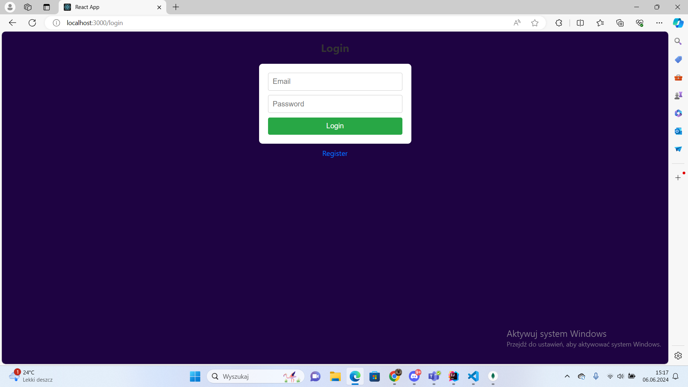
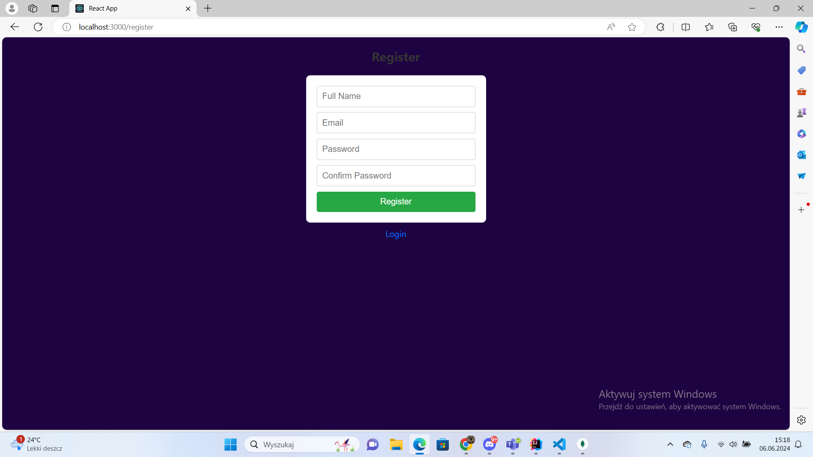
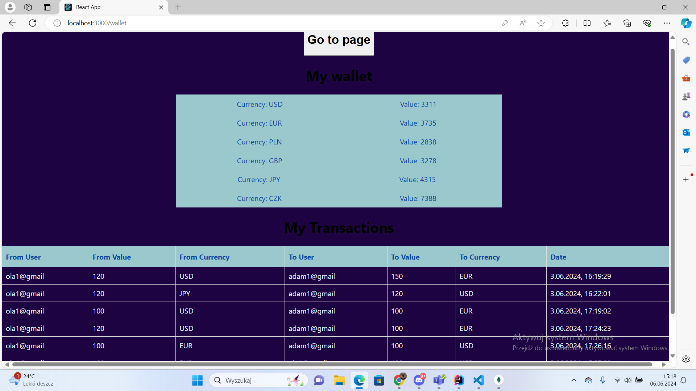
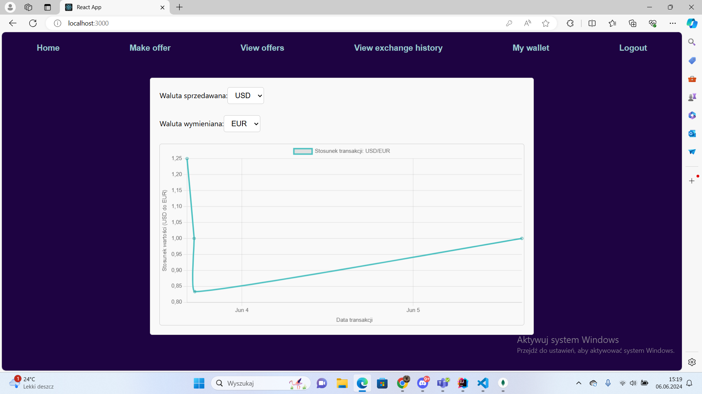
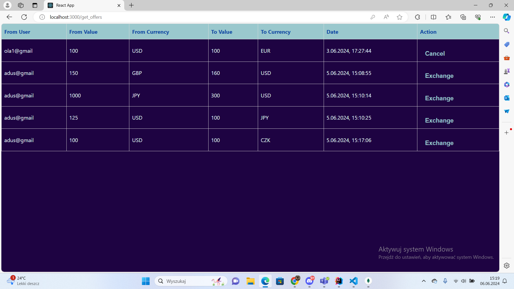
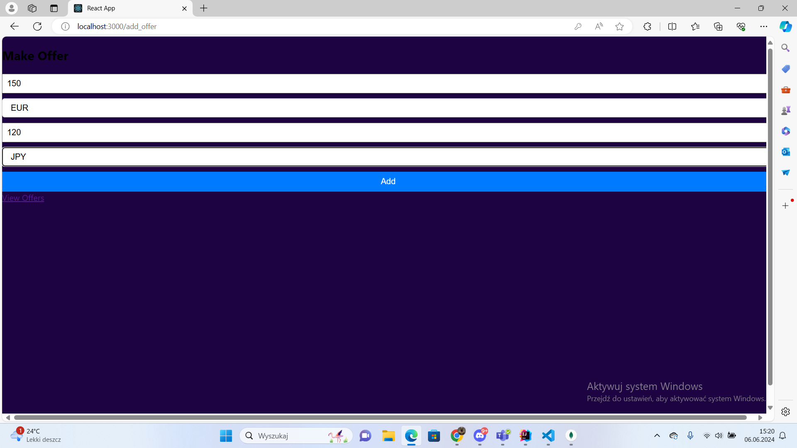
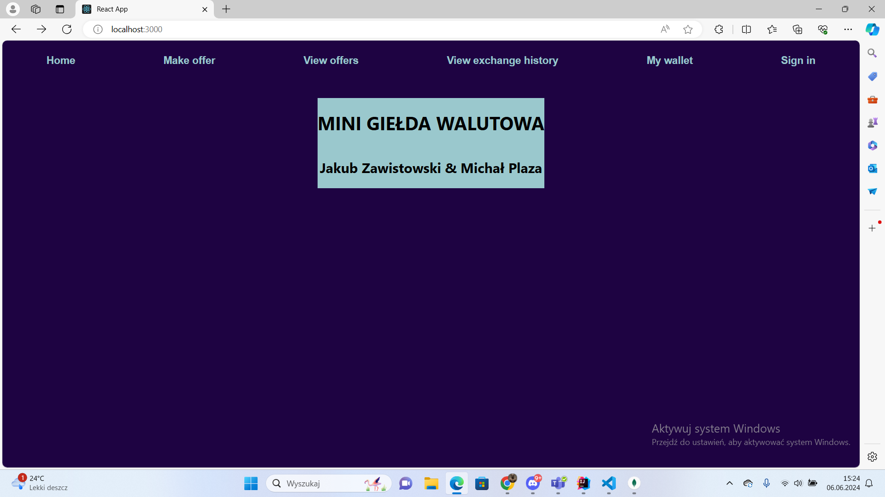

# Mini Currency Exchange

A web application that simulates a currency exchange platform where users can trade different currencies by creating and fulfilling exchange offers.

## Features

- **User Authentication**: Register, login, and logout functionality
- **Portfolio Management**: View your currency holdings and transaction history
- **Live Market**: View and interact with current exchange offers
- **Trade Execution**: Create new offers or fulfill existing ones
- **Automatic Matching**: System automatically matches and executes trades when advantageous
- **Historical Data**: View historical exchange rates through interactive charts

## Tech Stack

### Backend

- Flask 2.2.2 (Python 3.11.9)
- MongoDB (Database)
- PyMongo (Database connection)
- bcrypt (Password hashing)
- CORS (Cross-Origin Resource Sharing)

### Frontend

- React.js 18.3.1
- JavaScript ES14
- Axios (API communication)
- Chart.js (Data visualization)

## Getting Started

### Prerequisites

- Python 3.11+
- Node.js and npm
- MongoDB

### Installation

1. Clone the repository

   ```
   git clone https://github.com/yourusername/mini-currency-exchange.git
   cd mini-currency-exchange
   ```

2. Set up the backend

   ```
   pip install -r requirements.txt
   cd backend
   python app.py
   ```

3. Set up the frontend
   ```
   cd frontend
   npm install
   npm start
   ```

### Docker Setup

Alternatively, use Docker Compose to run the application:

```
docker-compose up
```

This will start both the Flask application and MongoDB instance.

## Application Structure

### Database Collections

- **users**: User account information
- **wallets**: User currency holdings
- **offers**: Active exchange offers
- **transactions**: Completed transaction history

### API Endpoints

- `/register`: Create a new user account
- `/login`: Authenticate user and start session
- `/logout`: End user session
- `/add_offer`: Create a new exchange offer
- `/get_offers`: Retrieve all available offers
- `/cancel_offer/<offer_id>`: Remove an offer and return funds
- `/make_transaction/<offer_id>`: Execute a transaction based on an offer
- `/all_transactions`: Get all historical transactions
- `/my_transactions`: Get transactions for the current user
- `/wallet`: Get current user's wallet information

## Screenshots

### Login Screen



### Registration



### User Portfolio



### Exchange Rate Charts



### Market Offers



### Create Offer



### Home Page



## Contributing

Contributions are welcome! Please feel free to submit a Pull Request.

## Author

- Michał Plaza

## License

This project is licensed under the MIT License.
